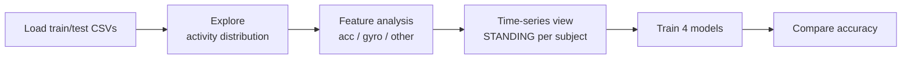

<div align="center">

# 🏃 Human Activity Recognition (HAR)

**Classify what a person is doing (walking, sitting, standing, lying…) from smartphone accelerometer and gyroscope data.**


**Best accuracy: 95.8% (Logistic Regression)**

</div>

---

## 📖 Overview

Wearables and phones record motion through their **accelerometer** and **gyroscope**. This internship project explores that sensor data and compares four classic machine learning models for recognizing six activities:

`WALKING` · `WALKING_UPSTAIRS` · `WALKING_DOWNSTAIRS` · `SITTING` · `STANDING` · `LAYING`

---

## 🏆 Results

| Model | Test accuracy |
|---|---|
| 🥇 **Logistic Regression** | **95.83%** |
| 🥈 Support Vector Classifier | 95.05% |
| 🥉 Random Forest | 92.98% |
| K-Nearest Neighbors | 90.02% |

*Numbers are from the saved notebook run. A bar chart comparing them is at the end of the notebook.*

---

## 🔬 What the notebook covers



1. **Data exploration**: activity label distribution (bar + pie charts)
2. **Feature analysis**: counts features coming from the accelerometer, gyroscope and other sources
3. **Time-series analysis**: plots the *angle between X and mean gravity* over time for different subjects while standing
4. **Modeling**: SVC, Logistic Regression, KNN and Random Forest
5. **Evaluation**: accuracy comparison chart

---

## 🚀 Getting Started

```bash
git clone https://github.com/gmgowrish/Human_Activity_Recognition-HAR-.git
cd Human_Activity_Recognition-HAR-

pip install numpy pandas matplotlib scikit-learn jupyter
```

**Dataset:** download `train.csv` and `test.csv` from [Kaggle](https://www.kaggle.com/code/abheeshthmishra/predictions-of-human-activity-recognition-96/input) and put them in a `Dataset/` folder:

```
Dataset/
├── train.csv
└── test.csv
```

Then run:

```bash
jupyter notebook Intership_Pro.ipynb
```

---

## 🛠️ Tech Stack

**Python** · **Pandas** · **NumPy** · **Matplotlib** · **scikit-learn** · **Jupyter Notebook**

---

<div align="center">

Made by **[G M Gowrish](https://github.com/gmgowrish)** · ⭐ Star the repo if you find it useful!

</div>
